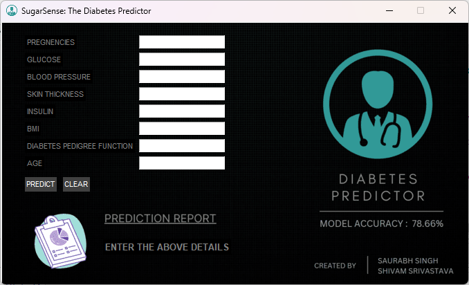

# SugarSense - The Diabetes Prediction Application

SugarSense is a user-friendly and interactive application developed using the Support Vector Machine (SVM) algorithm in Machine Learning and a Graphical User Interface (GUI) designed using the tkinter library in Python. The purpose of this application is to predict the likelihood of an individual having diabetes based on input features and provide an efficient and accessible means of assessing one's risk.

## Key Features

- **SVM Algorithm:** The heart of the application lies in its utilization of the Support Vector Machine algorithm, a powerful machine learning technique for classification and regression tasks. In this project, the SVM algorithm is trained on a diabetes dataset to learn patterns and relationships between input features and diabetes occurrence.
- **User-Friendly GUI:** The application features a user-friendly graphical interface built using the tkinter library. The GUI enables users to interact with the application effortlessly, enter their personal health information, and receive a prediction regarding their likelihood of having diabetes.
- **Input Data Collection:** User has to input relevant health attributes such as glucose level, blood pressure, body mass index (BMI), insulin level, and others. The application ensures that users provide valid and reasonable inputs to obtain accurate predictions.
- **Prediction Display:** Once the user inputs their health information, the SVM model processes the data and generates a prediction regarding the likelihood of diabetes. The application then displays a clear message indicating whether the individual is at high, moderate, or low risk of having diabetes.
- **Accuracy and Performance:** The SVM model's accuracy is **78.66%**

## Screenshots

## Authors

- [@saurabhsinghaa](https://www.github.com/saurabhsinghaa)
- [@shivamsrivastava121](https://www.github.com/shivamsrivastava121)

